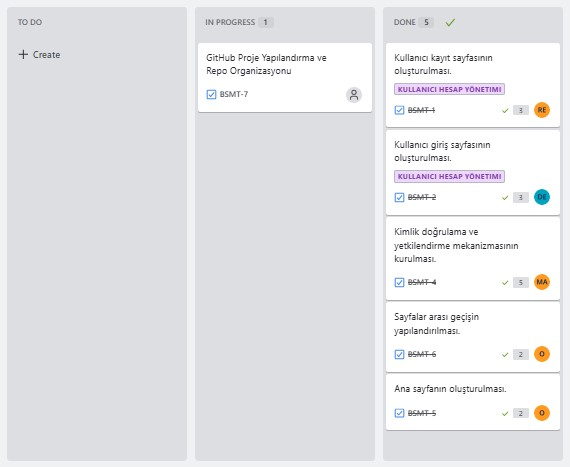

# TEAM NAME 

_YZTA Bootcamp Group 110_

# TEAM ROLES

- *Mert* __AYDIN__ - __Product Owner__     - 
- *Rumeysa Emine* __ŞAHİN__ - __Scrum Master__     -  
- *Didem* __ERÇETİN__ - __Team Member/Developer__     -  
- *Mevlüt Serhat* __ÖZŞAHİN__ - __Team Member/Developer__     - 

# PRODUCT NAME

__*MediMate*__ – Smart Medication Tracking Assistant

# PRODUCT DESCRIPTION

MediMate is an AI-powered mobile app developed to simplify medication management for users. It uses barcode scanning, OCR, and GenAI technologies to provide simple, reliable, and personalized information about medications. It also encourages regular and safe medication use by creating personalized reminders for users. It simplifies both individual health tracking and tracking the medications of family members.

# PRODUCT FEATURES

__1. Medication Identification and Information via Barcode__

- Scanning the barcode on the medication box using a camera

- Reading barcode data using OpenCV and OCR

- Providing simple explanations about the medication's intended use, side effects, and dosage instructions using GenAI

- Analyzing and alerting the user about potential interactions with their current medications

__2. Smart Medication Reminder System__

- Entering information such as medication name, dosage, frequency of use, start and end dates

- Reminders with automatic timed push notifications

- Ensuring complete medication use with dosage tracking

__3. Personalization and Safe Use__

- Special analyses based on the user's age, health status, allergy history, and other data

- Warnings about medications with interaction risks

- Easy-to-use, simple, and age-friendly interface

__4. Medication History and Reporting (Optional Development)__

- Reports on users' previous medication use and regularity

- Creation of PDF reports that can be shared with doctors

# TARGET AUDIENCE

- Elderly individuals and those with chronic illnesses (those who take medication regularly)

- Family members who monitor medication use (for parents, children)

- Individuals with busy work schedules (at high risk of forgetting to take their medication)

- Users with vision or cognitive impairments (who require simpler information and reminders)

- Healthcare professionals (doctors and nurses who want to make it easier for their patients to take their medication)

# PRODUCT BACKLOG
[Open Product Backlog in Jira](https://yzta-grup110.atlassian.net/jira/software/projects/BSMT/boards/34/backlog?epics=visible&atlOrigin=eyJpIjoiN2QyZDg0NjhlMWQyNGJlMjgwZjk4MmY1ZjUwMWEzYjgiLCJwIjoiaiJ9)

<strong><h1> SPRINT 1 </h1></strong>

- **Sprint Notes**
	- The product's goal, core features, and target user group were clearly defined.  
	- The chosen technology stack is Flutter, and Jira was selected as the project management tool.  
	- The GitHub repository was initialized and the core folder structure was set up.  
	- UI for the sign-up and login pages was implemented; navigation between pages was configured.  
	- Authentication and authorization mechanisms were established.  
	- Most of the tasks were completed on time, and team communication was maintained consistently.

- **Estimated Story Points to Complete:** `16`

- **Estimation Logic:** Tasks were estimated based on complexity, development time, and dependencies, using the Fibonacci sequence.  
	- UI tasks were assigned `2–3` points.  
	- More complex tasks such as security and infrastructure were assigned `5` points.  
	- Simpler technical tasks with lower uncertainty were assigned `1` point.

- **Daily Scrum:** [Click here to view the Daily Scrum notes](<docs/scrum_reports/sprint1-daily-scrum-report.md>)

- **Sprint Board Updates**  
	

- **Product Screenshots**  
        [MediMate-Sprint1](https://drive.google.com/drive/folders/1uVxNyLKgyaW3chgnGlmQRTq-g-Bd0RqQ?usp=drive_link)

- **Sprint Review**  
	- The core structure of the product was successfully established by the end of Sprint 1.  
	- User interfaces for the sign-up and login pages were completed, and navigation between pages was configured.  
	- Authentication and authorization mechanisms were activated and tested.  
	- The product is progressing in line with the defined goals, and the next sprints will focus on improving the user experience through detailed UI enhancements.

- **Sprint Retrospective**  
	- What Went Well: Team members took ownership of their tasks and worked diligently to complete them. Regular and effective communication was maintained via the WhatsApp group.

	- What Could Be Improved: Scheduling recurring meetings at specific days and times could help improve coordination.

<strong><h1> SPRINT 2 </h1></strong>

- **Sprint Notes:**

	- At the beginning of the sprint, the project scope was expanded to include the pharmacist role in the system.
	- Separate login systems were configured for both patient and pharmacist roles.
	- A dedicated panel was created for pharmacists to prescribe medications to patients.
	- A page was developed for patients to view their prescribed medications.
	- The process of generating medication explanations with `Google Gemini API` was initiated.
	- Due to limitations in accessing external APIs, a static `JSON` dataset was adopted.
	- Leveraging a `Gemini + RAG (Retrieval-Augmented Generation) `architecture, AI-powered medication descriptions were successfully generated using information from the dataset.
	- The project's code structure was refactored to align with the `Block Pattern` architecture.
	- Database connection with `Firebase` was established, and data recording operations were successfully implemented.
	- Regular team meetings were held.
	- Team members completed their tasks on time and with dedication. Communication was maintained via `WhatsApp` and `Google Meet`.

- **Estimated Story Points to Complete:** `50`

- **Estimation Logic:** tasks were assigned story points based on estimated effort, complexity level, and dependencies. A Fibonacci sequence-based system (1, 2, 3, 5, 7) was used for scoring:
	- `2` Points – Simple, low-complexity tasks that can be completed quickly  
	- `3` Points – Moderately complex tasks requiring a few hours of work  
	- `5` Points – Tasks involving integrations or requiring extra testing effort  
	- `7` Points – High-complexity tasks that affect multiple components or the overall system  

- **Daily Scrum:** [Click here to view the Daily Scrum notes](<docs/scrum_reports/sprint2-daily-scrum-report.md>)

- **Sprint Board Updates**
- **Product Screenshots**
- **Sprint Review**
- **Sprint Retrospective**

