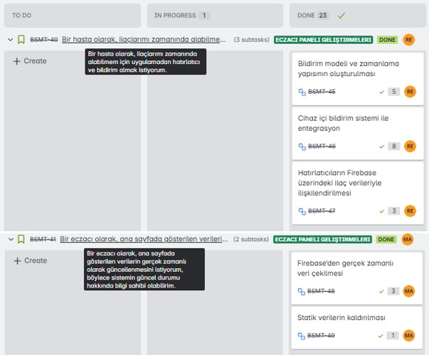

# TEAM NAME 

_MediMate Squad 110_

# TEAM ROLES

- *Mert* __AYDIN__ - __Product Owner__     - 
- *Rumeysa Emine* __ŞAHİN__ - __Scrum Master__     -  
- *Didem* __ERÇETİN__ - __Team Member/Developer__     -  
- *Mevlüt Serhat* __ÖZŞAHİN__ - __Team Member/Developer__     - 

# PRODUCT NAME

__*MediMate*__ – Smart Medication Tracking Assistant

# PRODUCT DESCRIPTION

MediMate is a mobile healthcare assistant designed to improve medication management and health awareness for patients through AI-powered features and real-time support. MediMate enables pharmacists to define personalized prescriptions, while patients can easily track their medications, receive timely reminders, and access detailed information about their treatment. With integrated Gemini AI services, users benefit from intelligent drug explanations and interaction risk alerts. MediMate aims to support safer, smarter, and more accessible healthcare experiences.

# PRODUCT FEATURES

- Personalized Medication Management: Pharmacists can assign customized prescriptions directly to patients within the app.

- Real-Time Medication Tracking: Patients can view their current medications, dosages, and schedules in an intuitive interface.

- Automated Reminders: Timely notifications help patients take their medications on schedule, improving adherence.

- AI-Powered Drug Information: Using Gemini AI, the app provides easy-to-understand explanations about medications and their uses.

- Drug Interaction Alerts: The system analyzes potential interactions between multiple medications and warns patients proactively.

- Intelligent Chatbot: An AI-driven chatbot answers users’ medication and health-related questions in natural language, providing personalized and accurate information.

- Secure Data Storage: Integration with Firebase ensures safe and reliable storage of user data and medication records.

- User-Friendly Design: The app features clear navigation and accessible interfaces for both patients and pharmacists.

# TARGET AUDIENCE

- Patients: Individuals of all ages who regularly take medication, struggle to keep track of their prescriptions, or want to learn more about their treatments.

- Pharmacists: Healthcare professionals who want to easily manage patient prescriptions digitally, assign medications, and enhance patient follow-up.

- Caregivers: Family members or professional caregivers supporting elderly, chronic patients, or those requiring continuous health monitoring by assisting with medication management.

- Healthcare Institutions: Clinics and hospitals seeking digital solutions to improve patient safety and medication tracking.

# PRODUCT BACKLOG
[Open Product Backlog in Jira](https://yzta-grup110.atlassian.net/jira/software/projects/BSMT/boards/34/backlog?epics=visible&atlOrigin=eyJpIjoiN2QyZDg0NjhlMWQyNGJlMjgwZjk4MmY1ZjUwMWEzYjgiLCJwIjoiaiJ9)

# SPRINT 1

- **Sprint Notes**
	- The product's goal, core features, and target user group were clearly defined.  
	- The chosen technology stack is Flutter, and Jira was selected as the project management tool.  
	- The GitHub repository was initialized and the core folder structure was set up.  
	- UI for the sign-up and login pages was implemented; navigation between pages was configured.  
	- Authentication and authorization mechanisms were established.  
	- Most of the tasks were completed on time, and team communication was maintained consistently.

- **Estimated Story Points to Complete:** `16`

- **Estimation Logic:** Tasks were estimated based on complexity, development time, and dependencies, using the Fibonacci sequence.  
	- UI tasks were assigned `2–3` points.  
	- More complex tasks such as security and infrastructure were assigned `5` points.  
	- Simpler technical tasks with lower uncertainty were assigned `1` point.

- **Daily Scrum:** [Click here to view the Daily Scrum notes](<docs/scrum_reports/sprint1-daily-scrum-report.md>)

- **Sprint Board Updates**  
	

- **Product Screenshots**  
        [MediMate-Sprint1](https://drive.google.com/drive/folders/1uVxNyLKgyaW3chgnGlmQRTq-g-Bd0RqQ?usp=drive_link)

- **Sprint Review**  
	- The core structure of the product was successfully established by the end of Sprint 1.  
	- User interfaces for the sign-up and login pages were completed, and navigation between pages was configured.  
	- Authentication and authorization mechanisms were activated and tested.  
	- The product is progressing in line with the defined goals, and the next sprints will focus on improving the user experience through detailed UI enhancements.

- **Sprint Retrospective**  
	- What Went Well: Team members took ownership of their tasks and worked diligently to complete them. Regular and effective communication was maintained via the WhatsApp group.

	- What Could Be Improved: Scheduling recurring meetings at specific days and times could help improve coordination.

# SPRINT 2 

- **Sprint Notes:**

	- At the beginning of the sprint, the project scope was expanded to include the pharmacist role in the system.
	- Separate login systems were configured for both patient and pharmacist roles.
	- A dedicated panel was created for pharmacists to prescribe medications to patients.
	- A page was developed for patients to view their prescribed medications.
	- The process of generating medication explanations with `Google Gemini API` was initiated.
	- Due to limitations in accessing external APIs, a static `JSON` dataset was adopted.
	- Leveraging a `Gemini + RAG (Retrieval-Augmented Generation) `architecture, AI-powered medication descriptions were successfully generated using information from the dataset.
	- The project's code structure was refactored to align with the `Block Pattern` architecture.
	- Database connection with `Firebase` was established, and data recording operations were successfully implemented.
	- Regular team meetings were held.
	- Throughout Sprint 2, tasks in the Jira backlog were structured using the epic → user story → task hierarchy for better organization and clarity.
	- Team members completed their tasks on time and with dedication. Communication was maintained via `WhatsApp` and `Google Meet`.

- **Estimated Story Points to Complete:** `50`

- **Estimation Logic:** Tasks were assigned story points based on estimated effort, complexity level, and dependencies. A Fibonacci sequence-based system (1, 2, 3, 5, 8) was used for scoring:
	- `2` Points – Simple, low-complexity tasks that can be completed quickly  
	- `3` Points – Moderately complex tasks requiring a few hours of work  
	- `5` Points – Tasks involving integrations or requiring extra testing effort  
	- `8` Points – High-complexity tasks that affect multiple components or the overall system  

- **Daily Scrum:** [Click here to view the Daily Scrum notes](<docs/scrum_reports/sprint2-daily-scrum-report.md>)

- **Sprint Board Updates**

	
	

- **Product Screenshots**
  
	[MediMate-Sprint2](https://drive.google.com/drive/folders/1uVxNyLKgyaW3chgnGlmQRTq-g-Bd0RqQ?usp=sharing)
  
- **Sprint Review**
	- Pharmacist Role Implementation:  A new pharmacist role was integrated into the system, which allowed pharmacists to define medications for patients.
	- Medication Assignment Panel: A functional interface was developed for pharmacists to add medicines using barcode input.
	- Patient Medication View: A page was developed for patients to view medications assigned to them, along with AI-generated explanations.
	- AI Integration with Gemini + RAG: A static JSON dataset and the Gemini API were used to generate clear and user-friendly medication summaries.
	- Firebase Integration: Real-time database capabilities were implemented to securely store and retrieve user and medication data.
	- BLoC Architecture Refactoring: The codebase was restructured according to the BLoC pattern for better maintainability and scalability.

- **Sprint Retrospective**
	- What Went Well: Problems encountered during the sprint were quickly addressed, and the team focused on finding solutions collaboratively. Effective communication and teamwork were achieved among the team members. Additionally, the transition to the BLoC architecture made the project’s code structure more organized and maintainable.

	- What Could Be Improved: To enhance the security of the GitHub repository, measures such as branch protection rules could be implemented. Moreover, using the project management tool Jira more actively and consistently could provide benefits in the next sprint.

# SPRINT 3 

- **Sprint Notes:**

	- The Firebase quota issue caused by excessive data load was resolved by integrating a new Firebase project.
	- Core features such as password reset, stock tracking, and patient listing were developed for both pharmacist and patient panels; page designs were also improved.
	- A system was implemented to automatically send `medication reminders` to patients based on prescriptions defined by the pharmacist.
	As the main focus of the sprint, AI integration was carried out by adding a `Gemini API-powered chatbot` that answers user questions and a feature that `analyzes drug interactions`.
	- A `Diagnoses` page was added to the patient panel, and models were developed to predict disease risks. Some models were attempted to be integrated into the project, but the expected performance was not achieved.
	- General testing of the application was completed, and the detected bugs were fixed.
	- Throughout Sprint 3, tasks in the Jira backlog were structured using the epic → user story → task hierarchy for better organization and clarity.
	- Team members completed their tasks on time and with dedication.
	- Regular team meetings were held. Internal communication was maintained via `WhatsApp` and `Google Meet`.

- **Estimated Story Points to Complete:** `85`

- **Estimation Logic:** Tasks were assigned story points based on estimated effort, complexity level, and dependencies. A Fibonacci sequence-based system (1, 2, 3, 5, 8) was used for scoring:
	- `1` Point – Very simple tasks, minimal effort
	- `2` Points – Low-complexity tasks with clear steps
	- `3` Points – Medium tasks involving logic or UI work
	- `5` Points – Complex tasks with integrations or testing
	- `8` Points – High-complexity tasks affecting multiple parts or involving AI/Firebase

- **Daily Scrum:** [Click here to view the Daily Scrum notes](<docs/scrum_reports/sprint3-daily-scrum-report.md>)

- **Sprint Board Updates**

	
	
	
	
	

- **Product Screenshots**

   [MediMate-Sprint3](https://drive.google.com/file/d/1bDc7vafpRupN9JnY7XUPXLWNJGeuzlCD/view?usp=drive_link)

- **Sprint Review**

	- Sprint 3 marked the final development cycle before project evaluation. Key progress was made to finalize core features and integrate AI capabilities.
	- A new Firebase project was integrated to ensure stable data flow and resolve quota limitations.
	- Essential features like password reset, patient listing, and stock tracking were completed.
	- AI-powered functionalities were added:
		- A Gemini-integrated chatbot that responds to user questions about medicines.
		- A drug interaction module that provides safety alerts for combined medications.
	- A diagnostic module for heart disease and diabetes risk scoring was introduced; while still in early form, it lays the groundwork for future enhancement.
	- Real-time medication reminders were successfully implemented.	
	- The project is now ready for evaluation as a smart, AI-assisted healthcare assistant with real-time capabilities.

- **Sprint Retrospective**

	- What Went Well: Sprint goals were successfully achieved, especially with the integration of AI features and scheduled notifications. Task distribution was clear, and team communication improved through regular meetings. Issues that came up were addressed quickly, with a strong focus on collaborative problem-solving.

	- What Could Be Improved: The diagnosis prediction feature still needs further research and model refinement to provide more accurate results. In addition, more extensive user testing could help detect rare or edge-case issues earlier.
