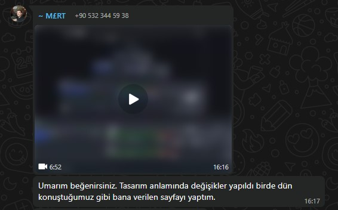
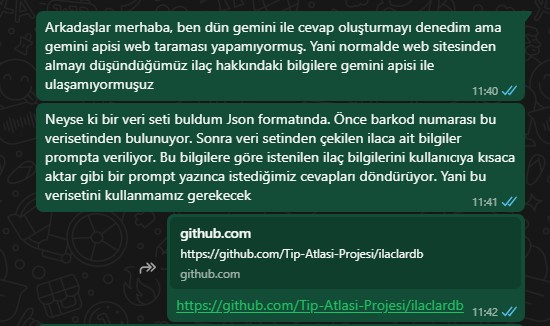
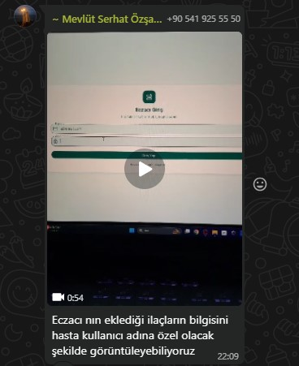
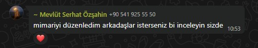
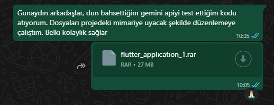

# Sprint 2 - Daily Scrum Raporu (7 Temmuz – 20 Temmuz)

## 🧭 Genel Bilgi
- Sprint başlangıcında, projenin kapsamı genişletilerek `eczacı rolü` sisteme dahil edildi.  
- Hasta ve eczacı rolleri için giriş sistemi ayrı ayrı yapılandırıldı.  
- Eczacının hastaya ilaç tanımlayabileceği bir panel oluşturuldu.  
- Hastaların kendilerine tanımlanan ilaçları görebileceği sayfa geliştirildi.  
- Google Gemini API ile ilaç açıklaması üretme süreci başlatıldı, ancak dış kaynaktan veri çekilemediği için sabit bir `JSON veri seti` kullanılmasına karar verildi.  
- Gemini + RAG mimarisiyle, yapay zeka destekli ilaç açıklamaları başarıyla oluşturuldu.  
- Proje kod yapısı `Bloc Pattern` mimarisine uygun şekilde yeniden düzenlendi.  
- `Firebase` ile veritabanı bağlantısı yapıldı ve veri kayıt işlemleri başarıyla gerçekleştirildi.  
- Düzenli ekip toplantıları yapıldı.  
- Ekip üyeleri görevlerini zamanında ve özveriyle tamamladı, iletişim genellikle `WhatsApp` ve `Google Meet` üzerinden sağlandı.

---

### 📅 7 Temmuz (Sprint Başlangıcı)
- Sprint başlangıcında toplantı yapıldı, proje hedefleri gözden geçirildi.  
- Sadece hasta odaklı sistemin yetersiz olacağı fark edilerek eczacı rolü eklendi. Uygulamanın iki yönlü mobil sağlık çözümü olması hedeflendi:  
  - Eczacılar, hastalara ilaç tanımlayabilecek.  
  - Hastalar, bu ilaçları görüntüleyip detaylarını inceleyebilecek ve hatırlatıcıları alabilecek.  
- Olası yeni özellikler tartışıldı ve haftalık görev dağılımı yapıldı.

---

### 📅 8 Temmuz
- Giriş sistemi, kullanıcı rolleri (eczacı/hasta) göz önünde bulundurularak yeniden yapılandırıldı.  
- Eczacılar için barkodla ilaç ekleyebilecekleri bir arayüz geliştirildi.  
- Firebase ile temel entegrasyon sağlandı.

---

### 📅 9 Temmuz
- Google Gemini API ile testler yapıldı.

- Başta, ilaç bilgilerini ilacabak.com  gibi bir siteden Gemini API ile çekmeyi planladık. Ancak Gemini API harici web sayfalarına doğrudan erişimi desteklemediği için bu yöntem işe yaramadı.

- Alternatif çözüm olarak, RAG (Retrieval-Augmented Generation) mimarisi ile desteklenecek bir veri seti kullanılmaya karar verildi.

- JSON formatında uygun bir ilaç veri seti bulundu. Bu veri setinin şu şekilde kullanılması planlandı:

    - Kullanıcı barkodu okutacak.

    - JSON dosyasından ilgili ilaç bilgisi alınacak.

    - Bu bilgi Gemini’ye gönderilerek sadeleştirilmiş ve açıklayıcı bir içerik elde edilecek.

---

### 📅 10 – 12 Temmuz
- Eczacı ana sayfası arayüzü geliştirildi.  
- Veritabanı yapısı düzenlendi.  
- Eczacının tanımladığı ilaçların hasta panelinde görüntülenmesi sağlandı.  
- Roller arası veri ilişkisi kurularak sistemin temel akışı tamamlandı.

---

### 📅 13 Temmuz
- `main` branch’e yapılan commitler sonrası proje yapısında bozulmalar tespit edildi.  
    - `smart_med_asistant/` klasörünün içeriği yanlışlıkla kök dizine taşınmış, `README.md` ve `docs/` klasörü silinmişti.  
- Sorunlar tespit edilip çözüm arandı. 
- Kod yapısı `Flutter BLoC mimarisine` uygun şekilde yeniden düzenlendi.

---

### 📅 14 Temmuz (Toplantı)
- Haftalık değerlendirme toplantısı yapıldı.  
- Proje mimarisi ve geliştirilen özellikler değerlendirildi.  
- Yapay zeka entegrasyonunun tamamlanması, öncelikli hedef olarak belirlendi.

---

### 📅 15 Temmuz
- Google Gemini API ile RAG tabanlı AI entegrasyonu başarıyla tamamlandı.  
- Barkodla ilaç tanımlama ve Gemini ile açıklama üretme süreci çalışır hale getirildi.

---

### 📅 16 Temmuz (Toplantı)
- Uygulamanın kullanıcı deneyimi ve işlevselliği değerlendirildi.
- Bir sonraki toplantıya kadar odak noktasının arayüz iyileştirmeleri ve kullanıcı dostu tasarım olması kararlaştırıldı.

---

### 📅 17 - 18 Temmuz
- Uygulamanın arayüz tasarımı ve kullanıcı deneyimi geliştirildi. 