# Sprint 3 - Daily Scrum Raporu (21 Temmuz – 3 Ağustos)

## 🧭 Genel Bilgi
- Aşırı veri yüklemesinden kaynaklanan Firebase kota aşımı sorunu, yeni bir Firebase projesi entegre edilerek çözüldü.
- Eczacı ve hasta panelleri için şifre sıfırlama, stok takibi ve hasta listeleme gibi temel özellikler geliştirildi; sayfa tasarımları da iyileştirildi.
- Eczacının tanımladığı reçetelere göre hastaya otomatik bildirim gönderen sistem geliştirildi.
- Sprint’in ana odak noktası olan yapay zeka entegrasyonu kapsamında, kullanıcı sorularını yanıtlayan `Gemini API` destekli bir chatbot ve ilaç etkileşimlerini analiz eden bir özellik uygulamaya eklendi.
- Hasta paneline `Teşhisler` sayfası eklenerek, hastalık risklerini tahmin etmeye yönelik modeller geliştirildi. Bazı modeller projeye entegre edilmeye çalışıldı, ancak beklenen performansa ulaşılamadı.
- Uygulamanın genel testleri yapıldı ve tespit edilen hatalar düzeltildi. 
- Düzenli ekip toplantıları yapıldı. 
- Ekip içi iletişim, `WhatsApp` ve `Google Meet` üzerinden sağlandı.

---

### 📅 21 Temmuz - 22 Temmuz (Sprint Başlangıcı)
- Sprint başlangıcında toplantı yapıldı. Projenin eksikleri belirlendi ve haftalık görev dağılımı yapıldı.

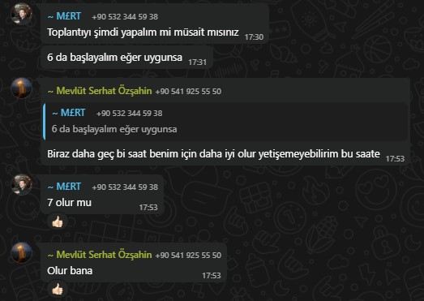

- Uygulama sayfaları tasarımsal olarak iyileştirildi.
- Eczacı ve hasta giriş sayfalarına şifre sıfırlama özelliği eklendi.
- Hasta panelinde ilaçların barkodları yerine adlarıyla listelenmesi sağlandı. 

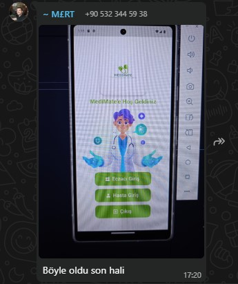

---

### 📅 23 Temmuz - 24 Temmuz
- Eczacıların ilaç stoklarını takip edebilmesi için `Stok Takibi` sayfası eklendi. 
- `Dashboard` sayfasındaki statik veriler kaldırılarak yerine Firebase’den gerçek zamanlı veriler çekildi. 
- Eczacı paneline ayarlar sayfası ve kritik stoktaki ilaçların listelendiği bir sayfa eklendi.
- Firebase’e aşırı veri yüklenmesi sonucu `Quota Exceeded` hatası alındı. Kullanım limitleri aşıldığı için verilere erişimimiz kısıtlandı. Çözüm için alternatif planlar değerlendirildi.

---

### 📅 25 Temmuz - 26 Temmuz
- Firebase kota sorunu nedeniyle yeni bir Firebase projesi oluşturulup mevcut Flutter projesine entegre edildi. 

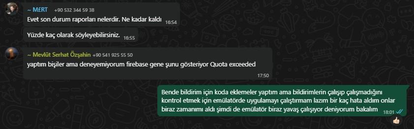
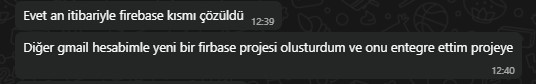

---

### 📅 27 Temmuz
- Eczacı paneline hastaları listeleyen `Hastalarım` sayfası eklendi.

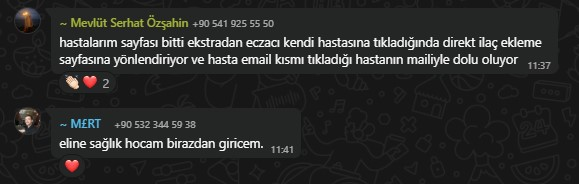

- Eczacının tanımladığı reçete bilgilerine göre hastanın otomatik bildirim alabileceği sistem geliştirildi.

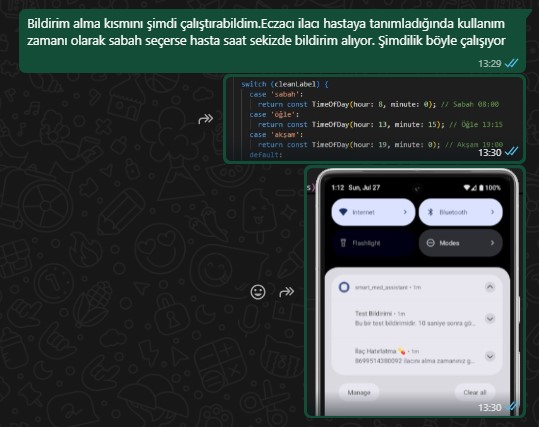

---

### 📅 28 Temmuz
- Haftalık değerlendirme toplantısı yapıldı. Yapay zekanın uygulamada daha etkin kullanılması için yeni görevler belirlendi:
    - İlaç etkileşim riskinin analizi: Hastanın kullandığı ilaçlar arasındaki olası etkileşimler yapay zekâ ile analiz edilerek hasta paneline uyarı olarak yansıtılması.
    - Hastalık riski tahmini: Kullanıcıdan alınan verilerle kalp rahatsızlığı veya diyabet gibi hastalık risklerinin tahmininin yapılması.
    - Chatbot: Kullanıcıların ilaç ve tıbbi konular hakkındaki sorularını yanıtlayacak bir chatbot geliştirilmesi.

--- 

### 📅 29 Temmuz
- `Gemini API` destekli chatbot projeye entegre edildi. Bu chatbot, kullanıcıların sorduğu soruları doğal dilde anlayıp, ilaca özel kişiselleştirilmiş cevaplar üretebiliyor.

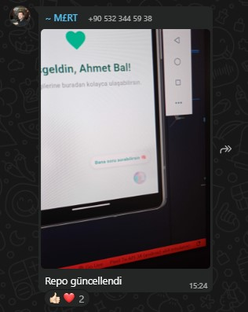
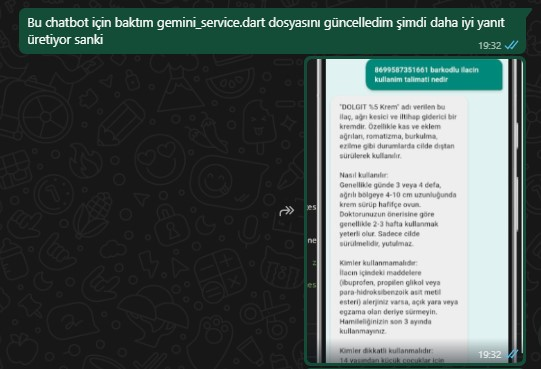

- Hasta paneline `Teşhisler` sayfası eklendi.
    - Sayfada kullanılmak üzere BMI ve psikolojik durum bölümleri hazırlandı.
    - Kalp rahatsızlığı ve diyabet tahmini için kullanılacak veri setleri araştırıldı ve ilgili modeller eğitildi.

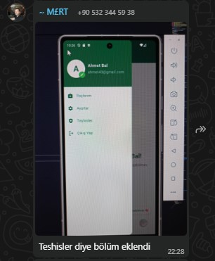
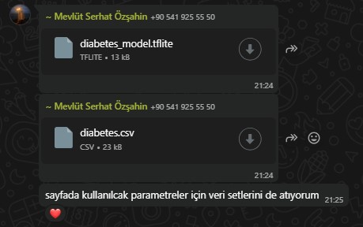  

--- 

### 📅 30 Temmuz

- İlaç etkileşim analizi özelliği eklendi. Bu özellik, birden fazla ilacın birlikte kullanımındaki potansiyel etkileşimleri analiz ederek, akademik terimler yerine hastaların kolayca anlayabileceği sade bir metin oluşturur.
- Akciğer ve göğüs kanseri teşhisleri için modeller eğitildi.

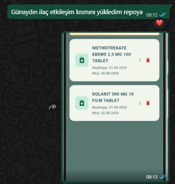
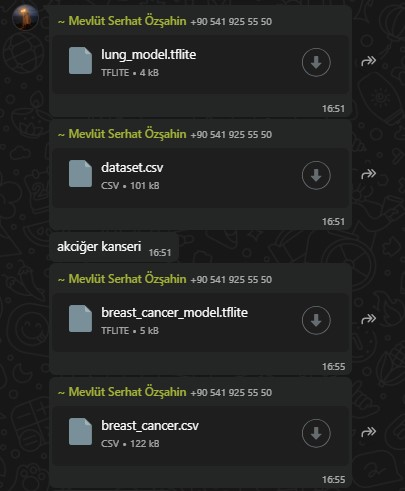

--- 

### 📅 31 Temmuz
- Eğitilen modeller projeye entegre edilmeye çalışıldı ancak istenen sonuçlar elde edilemedi.
- Uygulama test edildi, tespit edilen eksik ve hatalar düzeltildi.

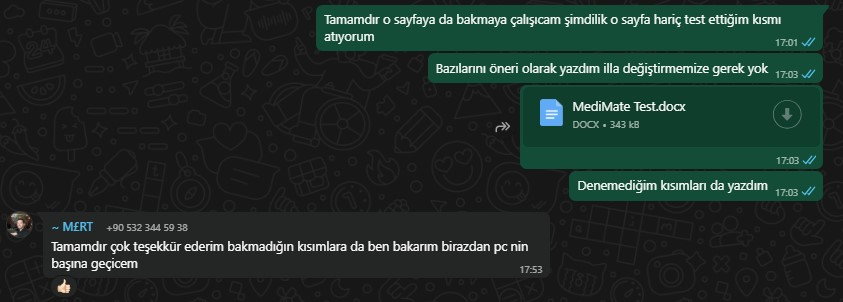

--- 

### 📅 1 Ağustos
- Uygulamanın son durumu toplantıda gözden geçirildi.

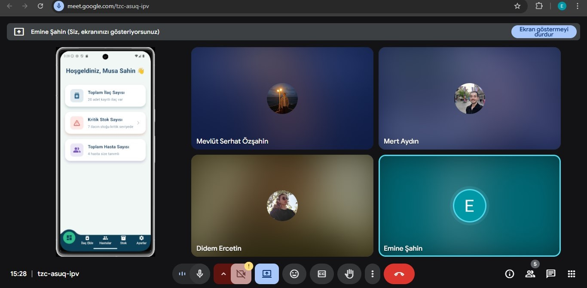

--- 